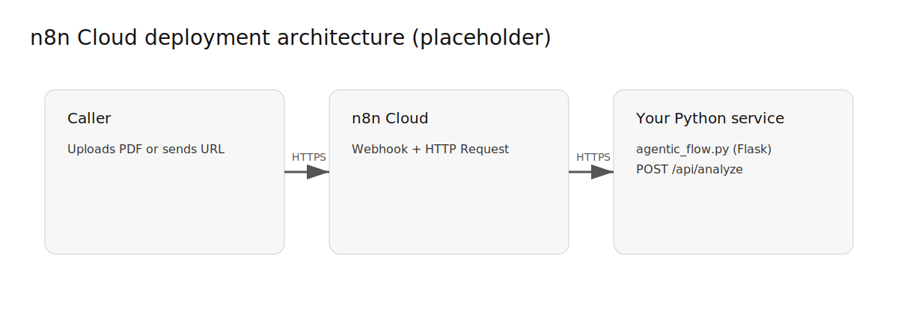
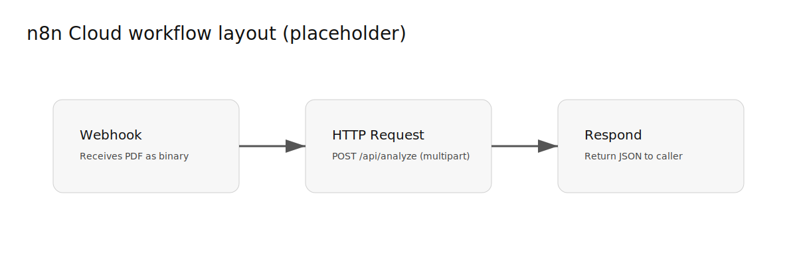
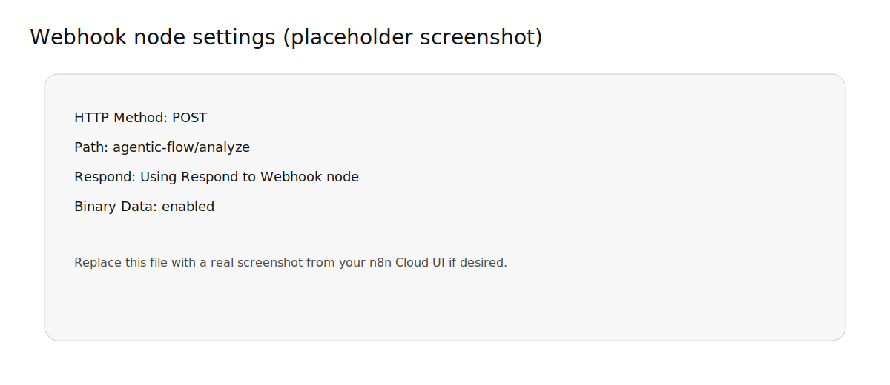
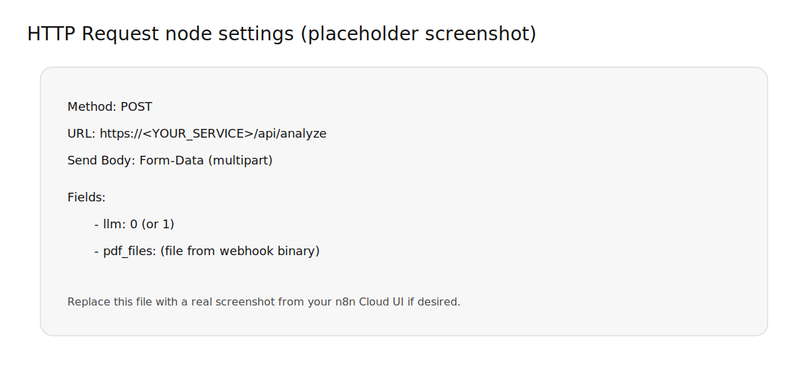

# Deploying with n8n Cloud (runbook)

n8n Cloud **cannot** run local shell commands (the **Execute Command** node is not available), so the “Webhook → Execute Command → Respond” workflow in `n8n/dist/agentic_flow_webhook.json` is meant for **self-hosted n8n**.

For **n8n Cloud**, the pattern is:

n8n Cloud Webhook → HTTP Request → your hosted Python API (`agentic_flow.py`) → Respond



## What you will deploy

- **n8n Cloud workflow**: receives a PDF (or a PDF URL), forwards it to your API, returns JSON.
- **Python service** (you host): runs `agentic_flow.py` in server mode and exposes:
  - `POST /api/analyze` (multipart upload: `pdf_files`)

## Prerequisites

1) A publicly reachable HTTPS URL for your Python service

You must run this repo somewhere n8n Cloud can reach over the internet (HTTPS), for example:

- A small VM (Windows/Linux) with a public URL + reverse proxy
- A container platform that supports long-running web services

2) Your service can accept file uploads

`/api/analyze` expects **multipart/form-data** with:

- `pdf_files` (one or more PDF files)
- optional form field `llm` with value `1` to enable the LLM judge

## Step 1 — Deploy the Python API

Your service is already implemented in `agentic_flow.py`.

### Run locally (dev sanity check)

```powershell
python agentic_flow.py --serve --host 127.0.0.1 --port 5099
```

Then test (example using curl):

```powershell
curl -X POST "http://127.0.0.1:5099/api/analyze" \
  -F "pdf_files=@C:\\path\\to\\report.pdf;type=application/pdf" \
  -F "llm=0"
```

### Run in production

- Run the Flask app behind HTTPS (recommended) and ensure `/api/analyze` is reachable.
- Make sure environment variables (like OpenAI keys) are present in that runtime.

If you want, I can add a minimal Dockerfile + production run command, but the workflow steps below work with any hosting.

## Step 2 — Build the n8n Cloud workflow

Create a new workflow in n8n Cloud with these nodes:

1) **Webhook** (trigger)
2) **HTTP Request** (forward the file to your Python API)
3) **Respond to Webhook**



### 2.1 Webhook node settings

Configure:

- **HTTP Method**: `POST`
- **Path**: something like `agentic-flow/analyze`
- **Response**: set to respond via the **Respond to Webhook** node
- **Binary data**: enabled (so the uploaded PDF becomes a binary property)

Capture a screenshot of this node after configuring it and save it as:

- `n8n/assets/screenshot-webhook-node.png`

Then update this README image reference if you want a real screenshot:

```md

```



### 2.2 HTTP Request node settings

This node calls your hosted Python API:

- **Method**: `POST`
- **URL**: `https://<YOUR_PUBLIC_SERVICE_HOST>/api/analyze`
- **Send Body**: `Form-Data (multipart)`

Add form-data fields:

- `llm`: `0` or `1`
- `pdf_files`: map from the incoming binary file

How to map the file depends on how you configured the Webhook node’s binary property name.

Common approach:

- Webhook stores the uploaded file under binary property name: `data`
- HTTP Request uses that same property as the file input

Capture a screenshot of the HTTP Request node configuration and save it as:

- `n8n/assets/screenshot-http-request-node.png`

Then update this README image reference:

```md

```



### 2.3 Respond to Webhook node

Return JSON to the original caller.

- Response body: the JSON coming back from your Python API

## Step 3 — Test end-to-end

### Option A: Upload a PDF to the n8n webhook (recommended)

Use `curl` from your machine (replace the webhook URL with the one shown by n8n Cloud):

```powershell
curl -X POST "https://<your-n8n-cloud-domain>/webhook/agentic-flow/analyze" \
  -F "data=@C:\\path\\to\\report.pdf;type=application/pdf"
```

Notes:

- The form field name (`data` above) must match what your Webhook node expects.
- If you use a different binary property name (e.g. `pdf`), update the `-F` field accordingly.

### Option B: Post a PDF URL instead of uploading

If your PDFs are already stored in S3/SharePoint/Drive/etc., another pattern is:

- Webhook receives JSON `{ "pdfUrl": "https://..." }`
- HTTP Request node downloads the PDF (as binary)
- Another HTTP Request node sends it to your Python API

This is slightly more work but avoids pushing large files through the webhook client.

## Security notes (important for Cloud)

- n8n Cloud webhooks are reachable over the public internet.
- Add a shared secret:
  - easiest: require a query param like `?token=...` and verify it in the workflow (IF node)
  - or use n8n’s built-in auth options if available in your plan
- Consider size limits and timeouts: PDF extraction can take time on large reports.

## Troubleshooting

- If the workflow returns HTML instead of JSON: ensure you’re calling `POST /api/analyze` (not `/`).
- If you get `{"error":"missing pdf_files"}`: the HTTP Request node did not send the file under field name `pdf_files`.
- If you get timeouts: increase n8n Cloud timeout settings if available, and/or host the Python service with enough CPU/RAM.

---

## Screenshots checklist (to replace placeholders)

Add these files under `n8n/assets/`:

- `screenshot-webhook-node.png`
- `screenshot-http-request-node.png`
- (optional) `screenshot-workflow-run.png`

Then replace the placeholder images in this README.
